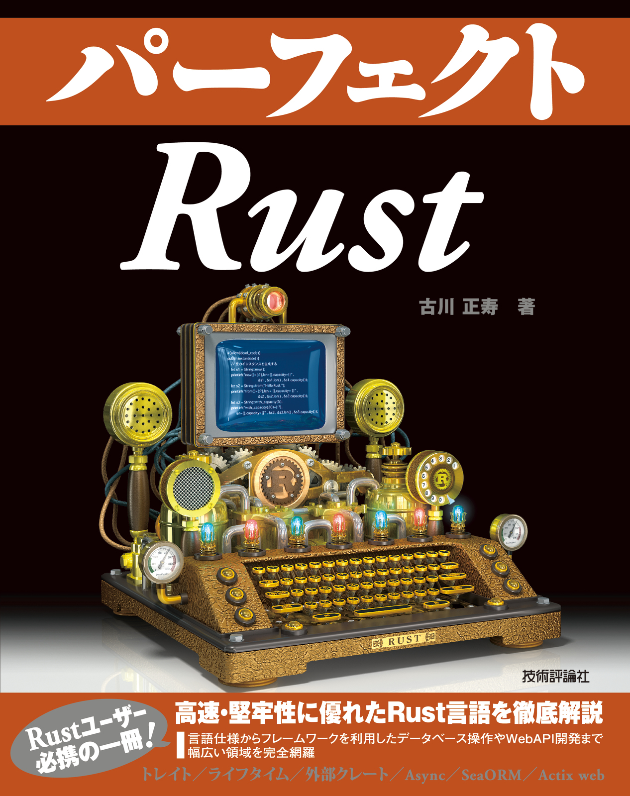

# perfect-rust
perfect-rust book

## ISBN
978-4-297-13322-1

## ref

* [Cargo Workspaces](https://doc.rust-lang.org/book/ch14-03-cargo-workspaces.html)
* [Pacckage Layout](https://doc.rust-lang.org/cargo/guide/project-layout.html)

## cargo test option

`cargo test -- --nocapture`

## cargo watch option

`cargo watch -x "test -- --nocapture"`
