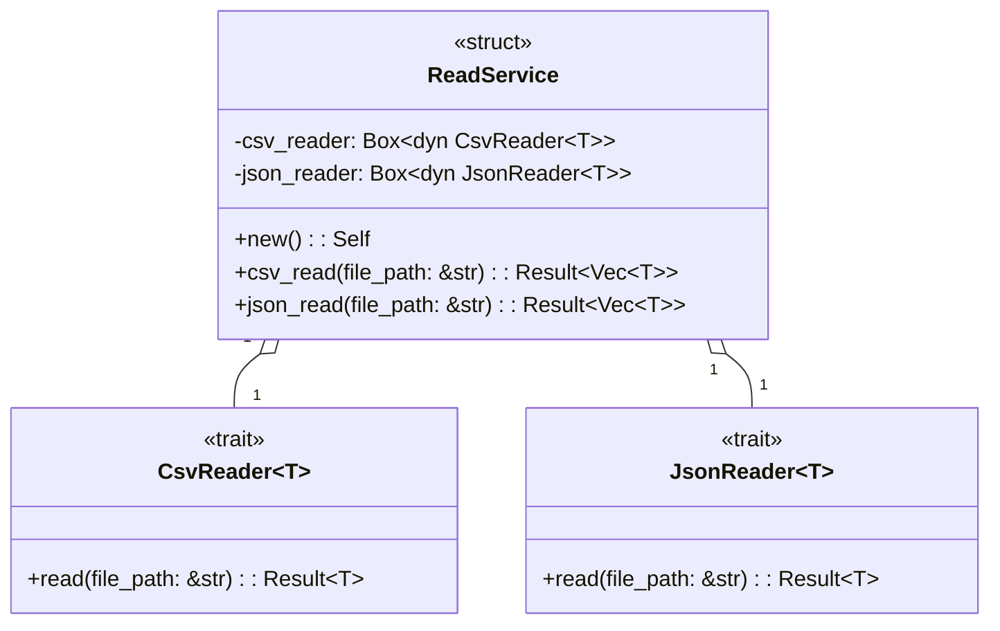

## Topic
- トレイトの基本
- ジェネリクストレイト
```rust
trait トレイト名<T[,..]> {
     fn メソッドまたは関連型関数名([引数名: T,..]) [-> T] {
         処理
     } 
}
```  
- 幽霊フィールド(PhantomData<T>)
- 関連型トレイト(Association Type)

```rust
trait トレイト名 {
    type 関連型;
     fn メソッドまたは関連型関数名([引数名: Self::関連型,..]) [-> Self::関連型] {
         処理
     } 
}
```

## ReadService

Box型とdynamicで抽象化


