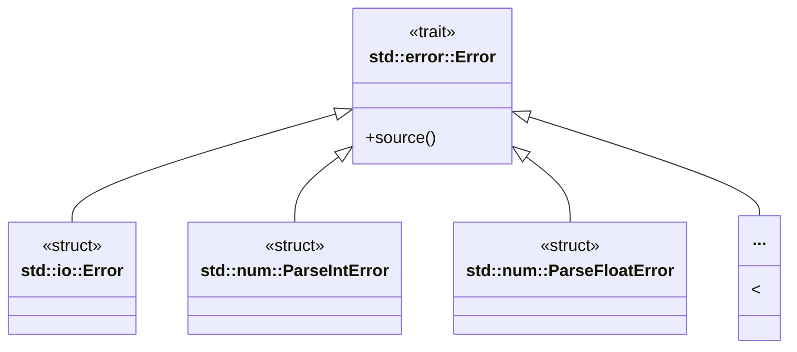

# Error

```mermaid
classDiagram
class `std::error::Error` {
    <<trait>>
    +source()
}
class `std::io::Error` {
    <<struct>>
}
class `std::num::ParseIntError` {
    <<struct>>
}
class `std::num::ParseFloatError` {
    <<struct>>
}
class `...` {
    <<struct>
}
`std::error::Error` <|-- `std::io::Error`
`std::error::Error` <|-- `std::num::ParseIntError`
`std::error::Error` <|-- `std::num::ParseFloatError`
`std::error::Error` <|-- `...`
```
