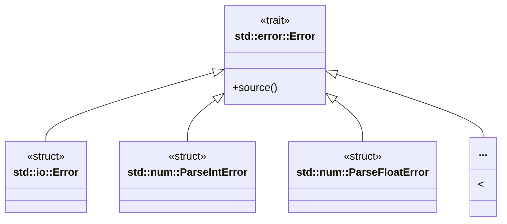

# Error
## Error の基本構造




## thiserror

```rust
/// thiserrorを利用することでErrorトレイトの実装
/// #[error] アトリビュートを利用してエラーメッセージ設定ができるためDisplayトレエイトの実装が不要になる
/// 🦀 タプルにはError型ではなくFromで変換した後の型を指定している Displayトレイトのto_string結果
/// 
#[derive(Error, Debug)]
enum SampleError {
    #[error("整数変換エラー:{0}")]
    IntError(String),   
    #[error("浮動小数点変換エラー:{0}")]
    FloatError(String),
}

/// #[error(transparent)] #[from] で透過させる
#[derive(Debug, Error)]
enum SampleError {
    #[error(transparent)] // 透過させる
    IntError(#[from] ParseIntError),
    #[error(transparent)]
    FloatError(#[from] ParseFloatError),
}
```

## anyhow

```rust
// Result型のエイリアス SampleResult
type SampleResult<T> = anyhow::Result<T, anyhow::Error>;

...
        anyhow::Error::new(error).context(content)
```