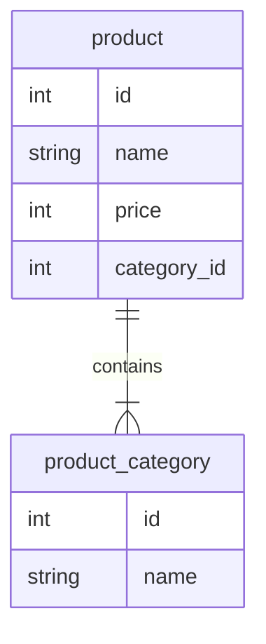

# PostgreSQL

## Docker
### run
```sh
docker run \
  --name pg \
  --detach \
  --publish 5432:5432 \
  --env POSTGRES_PASSWORD=admin \
  postgres
```

### exec

```sh
docker exec -it pg \
  psql -U postgres -d rust_sample
```

## 使用するテーブル構造


